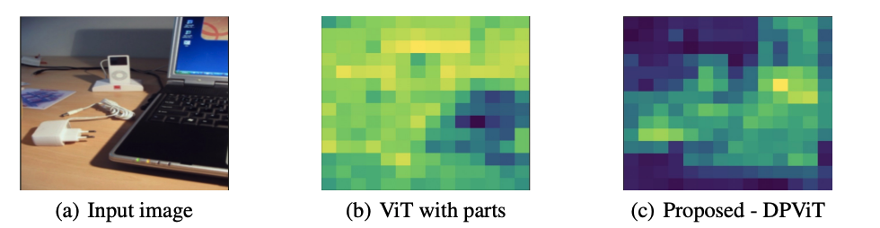
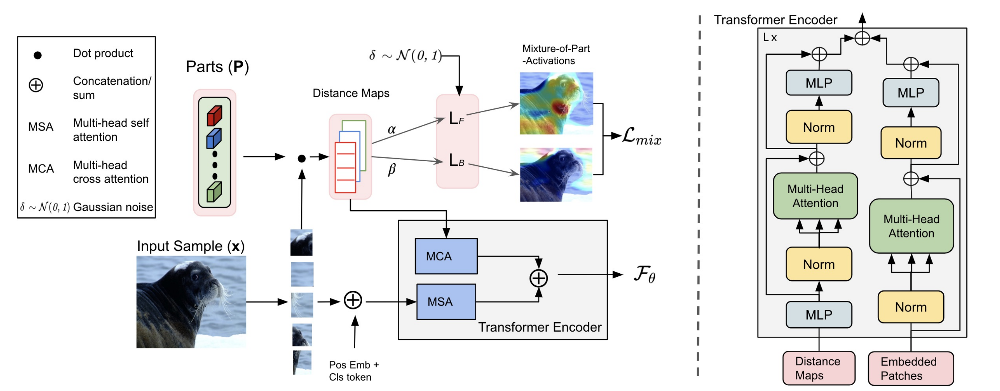

# DPViT
Pytorch implementation of DPViT (accepted at Neurips'23)

[](https://openreview.net/forum?id=8Xn3D9OtqI)
[](https://neurips.cc/media/PosterPDFs/NeurIPS%202023/72642.png?t=1700013873.5860884)
[](https://neurips.cc/media/neurips-2023/Slides/72642.pdf)


<p align="center">
    
</p>

> **[Mitigating the Effect of Incidental Correlations on Part-based Learning](https://openreview.net/forum?id=8Xn3D9OtqI)**<br>
> [Gaurav Bhatt*](https://gauravbh1010tt.github.io/), 
[Deepayan Das](https://deepayan137.github.io/),
[Leonid Sigal](https://www.cs.ubc.ca/~lsigal/), 
[Vineeth N Balasubramanian](https://people.iith.ac.in/vineethnb/)
<br>
## Outline

- [DPViT](#dpvit)
  - [Outline](#outline)
  - [Installation](#installation)
  - [Data Preparation](#data-preparation)
    - [miniImageNet](#miniimagenet)
    - [ImageNet-9](#imagenet-9)
  - [Training DPViT](#training-dpvit)
      - [On local machine:](#on-local-machine)
      - [On Slurm:](#on-slurm)
      - [GPU requirement](#gpu-requirement)
  - [Inference](#inference)
  - [Evaluation](#evaluation)
    - [Few-shot](#few-shot)
    - [ImageNet-9](#imagenet-9-1)
  - [Citation](#citation)


## Installation
The code has been tested with the following environment:
```bash
git clone https://github.com/GauravBh1010tt/DPViT.git
cd DPViT
conda env create --name dpvit --file=environment.yml
source activate dpvit
```

## Data Preparation

We extract the weakly-supervised masks using [](https://github.com/danielgatis/rembg) package. Since, RemBG is not optimized for batch inference, we modify thier code, and is present in  ```DPViT/data_utils/rembg```.
```bash
cd data_utils
python rembg/nbg_replace.py --dataset=miniIM --img_dir='path_to_train_folder' --batch_size=20
```
The image and it corresponding mask is saved a a single image. This is to speedup dataloading process over slurm by minimizing the number of file I/O calls.

### miniImageNet
Use the [mini-imagenet-tools](https://github.com/yaoyao-liu/mini-imagenet-tools) to create imagenet dataset. Please note that all datasets should have the format similar to ImagNet and should look like this:

```angular2html
|-- miniimagenet
|   |-- train
|   |   |-- n908761
|   |   |-- n453897
|   |   |-- ...
```
### ImageNet-9
Download the ImageNet-9 dataset from [ImageNet-9](https://github.com/MadryLab/backgrounds_challenge). The structure of files looks like this:

```angular2html
|-- in9
|   |--train
|   |   |-- 00_dog
|   |   |-- 01_bird
|   |   |   |-- ...
|   |-- bg_challenge
|   |   |-- mixed_same
|   |   |   |-- 00_dog
|   |   |   |-- 01_bird
|   |   |   |-- ...
|   |   |-- mixed_rand
|   |   |-- ...
```

## Training DPViT

<p align="center">
    
</p>


#### On local machine: 
```bash 
bash scripts/run_local.sh
```
Update the hyper-parameters in the run_local.sh file

#### On Slurm:
```bash
bash scripts/run_slurm.sh
```
You need to update the cluster-specific configuration in ```run_slurm.sh``` file.

#### GPU requirement
We train DPViT on 4 A100 GPUs with 40 GB of VRAM each. Try setting the batch size according to your spefications.

## Inference
By default the visualizations are saved inside the exp folder: ``` <exp_name>/visualization_epoch<#>```. The inference can be done on given images inside the ```img_viz``` folder using the following command:
```bash
python eval/eval_dpvit.py --ckp_path="path to saved checkpoint" --eval=0 --viz=1 --image_path='img_viz'
```

## Evaluation
### Few-shot
```bash
python eval/eval_dpvit.py --ckp_path="path to saved checkpoint" --eval=1 --num_shots=5
```

### ImageNet-9
```bash
python eval/imagenet_cls.py --pretrained_weights="saved model" --data_path "data/in9" --partition "bg_challenge/mixed_same/val" --num_classes 9
```
Choose one of the following partitions from ImageNet-9 : ```mixed_same, mixed_rand, ...```

## Citation
If you find this repo useful, please cite:
```
@inproceedings{bhatt2023mitigating,
  title={Mitigating the Effect of Incidental Correlations on Part-based Learning},
  author={Bhatt, Gaurav and Das, Deepayan and Sigal, Leonid and Balasubramanian, Vineeth N},
  booktitle={Thirty-seventh Conference on Neural Information Processing Systems},
  year={2023}
}
```